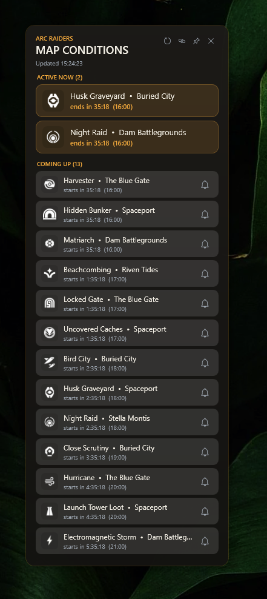

# ARC Raiders — Map Conditions

A standalone **Windows desktop overlay** that shows live **ARC Raiders** map
conditions — which events are active now and what's coming up — with per-second
countdowns and optional start reminders. No Rainmeter required.

It is a C# / WPF successor to the original [*ARC Map Conditions*](https://github.com/StasEdward/Rainmeter_Skins) Rainmeter skin:
same data source (`arcraiders.com/map-conditions`), the same battle-tested
parsing logic ported from Lua to C#, and a refreshed card-based UI.




## Download

Grab the latest ready-to-run build from the [**Releases**](../../releases/latest)
page: download **`ArcMapConditions-win-x64.zip`**, extract it anywhere, and run
`ArcMapConditions.exe`. The build is self-contained — **no .NET installation
needed**. (To start it automatically at logon, drop a shortcut to the exe into
`shell:startup`.)

Builds are produced automatically by GitHub Actions (see
[`.github/workflows`](.github/workflows)); every push is compiled and the parser
tests are run, and pushing a `v*` tag publishes a Release.

## Features

- **Active now** and **Coming up** sections, refreshed from the official page
  every 60 seconds.
- **Live countdowns** that tick every second (independent of the refresh) with
  the local wall-clock start/end time in brackets.
- **Start reminders** — click the bell on any upcoming event to get a bottom-right
  popup and a chime the moment it begins.
- **Frameless, always-on-top overlay** — drag it anywhere, pin/unpin, parks in
  the top-right corner. It auto-sizes to the number of events and only shows a
  thin, unobtrusive scrollbar when there are more than fit on screen.
- **No timezone bugs** — countdowns come from the page's own countdown token,
  pinned to the local clock, so no local/UTC mixing.

> Like any window overlay (Rainmeter included), it is not drawn over games in
> **exclusive** fullscreen. Run ARC Raiders in **Borderless / Windowed
> Fullscreen** and the widget stays visible.

## Requirements

- Windows 10 / 11
- [.NET 10 SDK](https://dotnet.microsoft.com/download/dotnet/10.0) to build, or the
  .NET 10 Desktop Runtime to run a published build.

## Build & run

Open `ArcMapConditions.App.sln` in Visual Studio 2022 and press **F5**, or from a
terminal:

```powershell
dotnet run --project src/ArcMapConditions.App
```

### Publish a single self-contained exe

```powershell
dotnet publish src/ArcMapConditions.App -c Release -r win-x64 `
  --self-contained true `
  -p:PublishSingleFile=true -p:IncludeNativeLibrariesForSelfExtract=true
```

The result is a single `ArcMapConditions.exe` under
`src/ArcMapConditions.App/bin/Release/net10.0-windows/win-x64/publish/`.
To launch it at logon, drop a shortcut to that exe into `shell:startup`.

## Using it

- **Drag** the widget by its header; **right-click** for a menu (refresh, open
  the site, pin on top, exit). The header buttons do the same.
- **Subscribe to an event:** click the **bell** on a *Coming up* row — it turns
  orange. When that event starts you get a popup in the bottom-right corner and a
  chime. Reminders survive the 60-second refresh, fire once each, and don't steal
  focus from the game.

## How it works

Every 60 seconds the app downloads `arcraiders.com/map-conditions` and parses the
`Active now` / `Coming up` cards:

- The condition name is derived from the link slug
  (`/map-conditions/lush-blooms` → *Lush Blooms*), so new conditions are picked up
  automatically; unknown ones fall back to a generic icon.
- Each card carries a server-rendered countdown token (`16:06`, `1:16:06`). The
  app parses that, pins it to the local clock at download time, and ticks it down
  every second — **no absolute-time or timezone math**. A fallback parses the
  printed UTC date range if the token is ever missing.

The parsing logic has no UI dependency and is covered by a cross-platform
console test under `tests/ParserSmokeTest`.

## Project structure

| Path | Purpose |
| --- | --- |
| `Core/ConditionsParser.cs` | HTML → entries. C# port of the original `Parser.lua`. |
| `Core/CountdownFormat.cs` | `H:MM:SS` / `M:SS` formatting. |
| `Services/MapConditionsService.cs` | Downloads the page (`HttpClient`). |
| `Services/IconProvider.cs` | Loads condition icons by slug, with generic fallback. |
| `Services/SubscriptionManager.cs` | Tracks reminder subscriptions; reports which just started. |
| `Services/NotificationService.cs` | Plays the chime and opens the reminder popup. |
| `ViewModels/MainViewModel.cs` | 60 s refresh + 1 s tick; exposes the two lists; fires reminders. |
| `ViewModels/ConditionRow.cs` | One row; recomputes its countdown each tick; bell toggle. |
| `MainWindow.xaml` / `Theme.xaml` | The overlay UI. |
| `ToastWindow.xaml` | The bottom-right reminder popup. |
| `Assets/icons/*.png` | Condition icons (filename = slug). |
| `Assets/sounds/notify.wav` | Notification chime (any PCM WAV works). |
| `app.ico` | Application icon. |
| `tests/ParserSmokeTest` | Cross-platform console asserting the parser + subscriptions. |

## Customizing

- **Refresh interval:** `RefreshSeconds` in `MainViewModel.cs`.
- **Colors / fonts / sizes:** `Theme.xaml` (accent `#F0A83C`, text `#F2EEE4`,
  dim `#9AA3AD`).
- **Icons:** replace any PNG in `Assets/icons` (keep the slug filename, e.g.
  `harvester.png`; must be a real PNG). Unknown conditions use `generic.png`.
- **Sound:** replace `Assets/sounds/notify.wav` with any PCM WAV.
- **If the site markup changes** and parsing breaks, adjust the regexes in
  `ConditionsParser.ExtractEntries` — the smoke test documents the expected input
  shape.

## Credits

Data from [arcraiders.com/map-conditions](https://arcraiders.com/map-conditions).
Successor to the *ARC Map Conditions* Rainmeter skin. For personal use.
